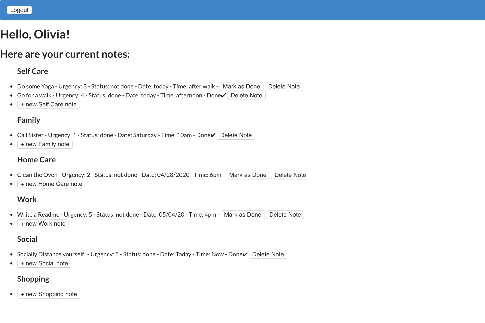

# README

## Flatnote

### Front-end Repo: https://github.com/maddeno/flatnote-frontend

### Demo: https://drive.google.com/open?id=1rW8R_mAbXNXwHNujyfmeWIc8THs9y9vM

### Back-end Features:

### Technologies:
  - Ruby 2.6.1
  - Rails 6.0.2
  - Postgresql 0.18

### Installing: 
  - clone this repo to your local machine ```git@github.com:maddeno/backend_flatnote.git```
  - run bundle install to install required dependencies
  - run rails db:create to create a database locally.
  - run rails db:migrate to create tables into the database.
  - run rails db:seed to create seed data.
  - run ```rails s``` to run the server.
  - to start the full app don't forget to install and run the front-end https://github.com/maddeno/flatnote-frontend



Flatnote is a to-do list app with a React front-end and a Rails back-end. The back-end relational database stores users, task-categories, and the joiner: notes. Notes belong to a user and belong to a task. 

When a user logs in they are taken to the TaskList component. This renders a table of the six different tasks as well as all of the pre-existing notes that fall under those tasks. From there users can create new notes, update existing notes to "done", and delete notes. 

To start run ```rails s```. Use the link at the top of the Readme to access the front-end repo and in another terminal run ```npm start```. 
